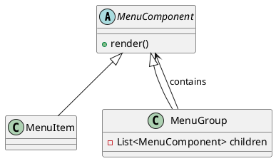

# Composite Pattern

Composite trata objetos individuais e agregados de maneira uniforme. No exemplo, `MenuComponent` abstrai tanto `MenuItem` quanto `MenuGroup`, permitindo percorrer a árvore para renderizar qualquer combinação.

## Anti-pattern relacionado
`Deep if tree`: cada nó precisa saber se é folha ou grupo, duplicando `instanceof` e lógicas recursivas por todos os lados.

## UML rápida
Diagrama editável disponível em `diagram.puml`.

## Arquivos
- `PatternExample.java`: árvore composta percorrida de forma uniforme.
