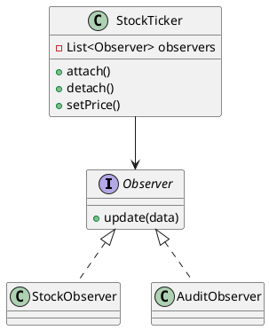

# Observer Pattern

O Observer mantém vários objetos sincronizados com o estado de um sujeito. Sempre que `StockTicker` muda, `MobileDisplay` e `AuditLog` recebem o evento automaticamente. É muito comum em UI, eventos de domínio e integrações.

## Anti-pattern relacionado
Quando cada consumidor consulta o estado manualmente (ou o sujeito chama cada dependente diretamente sem contrato), nasce o anti-pattern `Spaghetti Notification`: lógica duplicada, ordem de chamada imprevisível e vazamentos de dependência.

## UML rápida
Diagrama editável disponível em `diagram.puml`.

## Arquivos
- `PatternExample.java`: implementação clássica com attach/detach.
