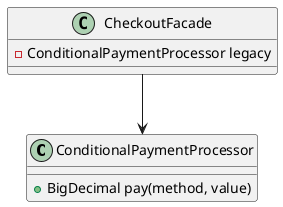

# Anti-pattern Strategy: Conditional Explosion

Quando ignoramos o Strategy, criamos serviços gigantes com condicionais múltiplas (`ConditionalPaymentProcessor`). A manutenção fica cara, cada novo método de pagamento pede outro `if`, e a classe vira um anti-pattern semelhante a um `God Object` voltado para regras. O README também mostra como evoluir essa estrutura para o Strategy correto.

## Anti-pattern em destaque
- Um único método conhece todos os detalhes de negócio.
- Testes ficam difíceis, porque é necessário montar diversos cenários numa mesma rotina.
- Violação direta do Open/Closed Principle.

> Para a versão saudável usando Strategy, consulte a pasta `strategy-pattern`.

## UML simplificada
Diagrama editável disponível em `diagram.puml`.

## Arquivos
- `AntiPatternExample.java`: implementação rígida e difícil de escalar.
