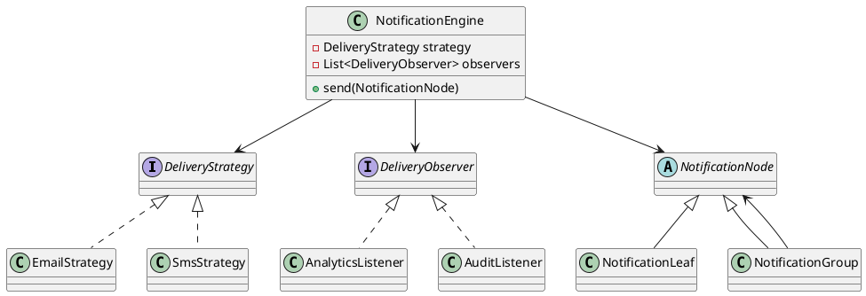

# Strategy + Observer + Composite

Campanhas de marketing combinam múltiplas mensagens (Composite), podem ser disparadas por diferentes canais (Strategy) e ainda informam interessados (Observer). Nesta pasta unimos os três patterns para ilustrar um fluxo completo e o respectivo anti-pattern monolítico.

## UML mental
Diagrama editável disponível em `diagram.puml`.

## Arquivos
- `PatternExample.java`: engine orquestrada com os três patterns.
