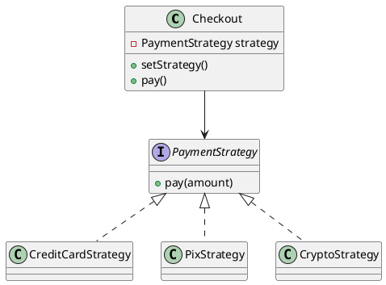

# Strategy Pattern

Pequenas famílias de algoritmos são encapsuladas atrás de uma mesma interface (`PaymentStrategy`), permitindo alternar o comportamento em tempo de execução sem alterar o cliente. Isso reduz condicionais repetidos e facilita a extensão de novos comportamentos.

## Anti-pattern relacionado
`God Conditional` (ou o clássico `if/else` gigante) centraliza todas as regras dentro de um único método. O cliente precisa conhecer todos os casos e mudar sempre que um novo algoritmo surge, aumentando o acoplamento e o risco de regressão.

## UML rápida
Diagrama editável disponível em `diagram.puml`.

## Arquivos
- `PatternExample.java`: checkout flexível usando Strategy.
